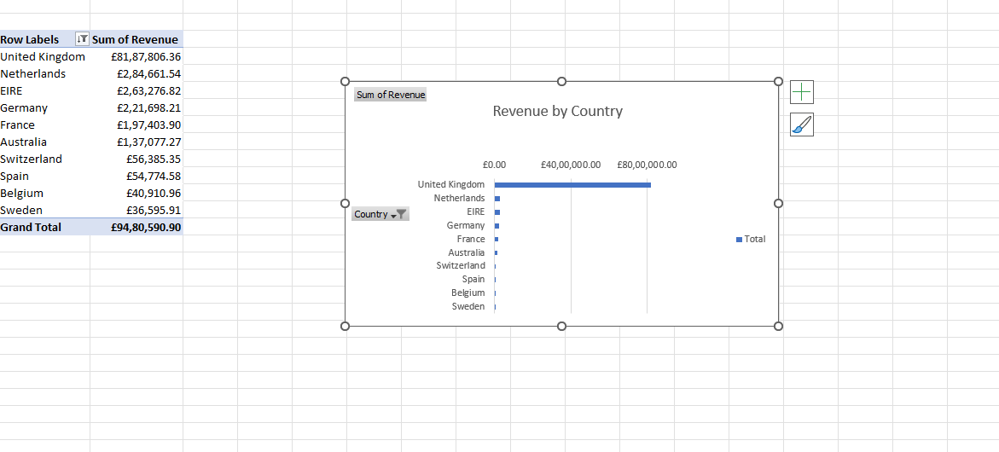
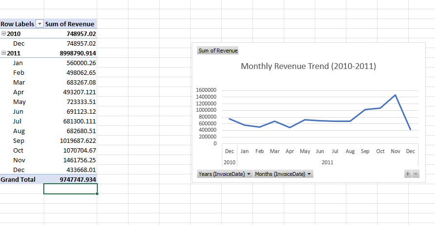
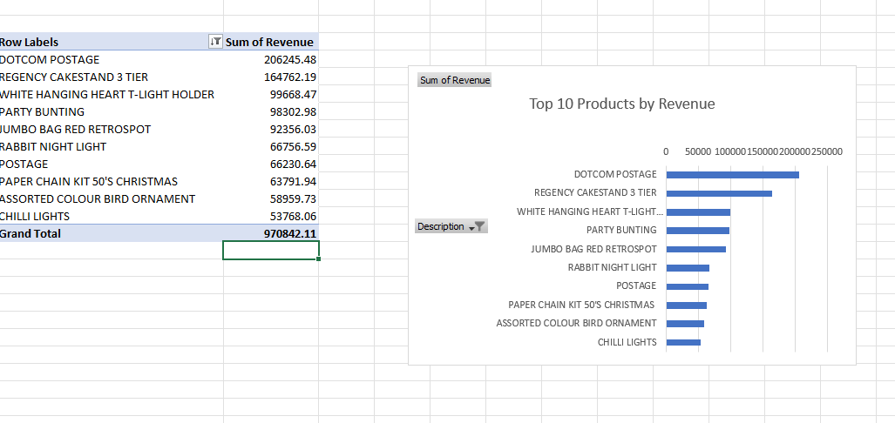
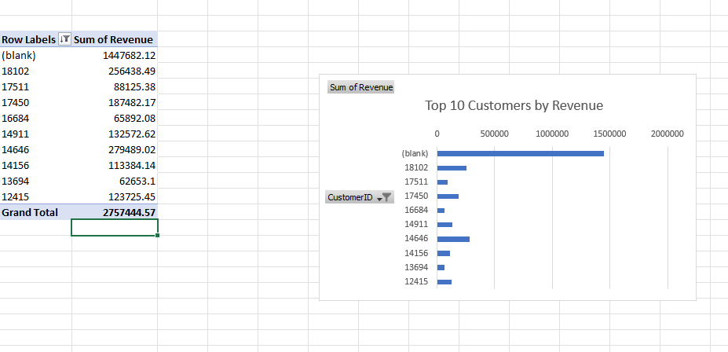

##Retail Sales Data Analysis (Excel)

Project Overview
This project analyzes an online retail dataset using Microsoft Excel to identify revenue patterns, top-performing products, and key customers.

##Tools Used
Microsoft Excel
Pivot Tables
Data Visualization

## Revenue by Country

Insight: The United Kingdom generates the majority of revenue, followed by the Netherlands, Ireland, and Germany.

## Monthly Revenue Trend

Insight: Revenue increases toward the end of the year and peaks around November, indicating strong seasonal demand.

## Top 10 Products by Revenue

Insight: A small number of products generate a large portion of total sales.

## Top 10 Customers by Revenue

Insight: A few customers contribute significantly to total revenue.

